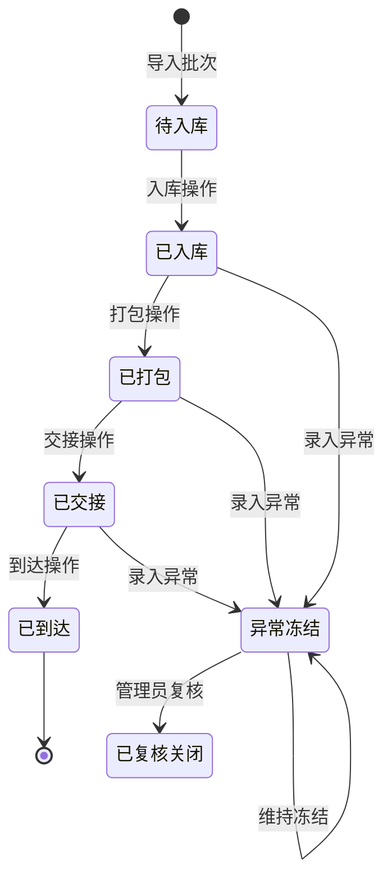

## 1. 产品概述

实验室样本转运台账系统，用于管理生物/医学样本从入库到到达目的地的全流程状态追踪，支持异常冻结与复核关闭机制，确保样本运输过程的可追溯性和数据完整性。

- 目标用户：实验室操作员、质量管理员、运输交接人员
- 核心价值：实现样本转运全生命周期数字化管理，保障样本安全，提升台账管理效率

## 2. 核心功能

### 2.1 用户角色

| 角色 | 注册方式 | 核心权限 |
|------|----------|----------|
| 普通操作员 | 系统预置账号 | 样本导入、入库、打包、交接、到达登记、录入异常（超温/破损）、查看样本列表与详情 |
| 管理员 | 系统预置账号 | 拥有普通操作员全部权限，此外可复核关闭异常样本、管理用户 |

### 2.2 功能模块

1. **登录页**：用户身份认证，角色区分
2. **样本列表页**：样本台账总览，支持筛选搜索，状态色标
3. **样本详情页**：样本信息、状态时间线、证据记录、操作面板
4. **批次导入**：批量导入样本（CSV/JSON），自动去重
5. **交接单导出**：导出指定批次或样本的交接清单

### 2.3 页面详情

| 页面名称 | 模块名称 | 功能描述 |
|----------|----------|----------|
| 登录页 | 登录表单 | 用户名密码登录，角色自动识别 |
| 样本列表页 | 顶部导航 | 用户信息、退出登录、批次导入按钮、导出按钮 |
| 样本列表页 | 筛选栏 | 按状态、批次号、sample_id 搜索筛选 |
| 样本列表页 | 样本表格 | 展示 sample_id、批次、当前状态、最新温度、创建时间、操作按钮 |
| 样本详情页 | 基本信息卡 | sample_id、批次、样本类型、当前状态 |
| 样本详情页 | 状态时间线 | 可视化展示所有状态变更及时间戳 |
| 样本详情页 | 证据记录区 | 温度记录、照片路径、文字描述 |
| 样本详情页 | 操作面板 | 根据当前状态显示可用操作按钮 |
| 批次导入弹窗 | 导入表单 | 文件上传/粘贴、预览、确认导入、重复项提示 |

## 3. 核心流程

### 3.1 主流程（入库 → 到达）

操作员登录系统 → 导入样本批次 → 执行入库操作 → 执行打包操作 → 执行交接操作 → 接收方执行到达操作 → 流程完成

### 3.2 异常处理流程

运输中发现超温或破损 → 操作员录入异常并上传证据 → 系统自动将样本置为"异常冻结"状态 → 普通操作员无法关闭 → 管理员登录进行复核 → 填写复核备注 → 关闭异常或维持冻结

### 3.3 状态流转图

## 4. 用户界面设计

### 4.1 设计风格

- **主色调**：深蓝（#1e3a5f）代表专业与可信，搭配青色（#0ea5e9）作为强调色
- **状态色**：绿色（正常）、橙色（运输中）、红色（异常冻结）、灰色（完结）
- **按钮风格**：圆角矩形，微阴影，hover 时轻微上浮
- **字体**：系统默认无衬线字体，清晰易读
- **布局风格**：卡片式布局，顶部导航 + 主体内容区
- **图标风格**：使用简洁的 SVG 图标，统一线性风格

### 4.2 页面设计概览

| 页面名称 | 模块名称 | UI 元素 |
|----------|----------|---------|
| 登录页 | 登录卡片 | 居中卡片、输入框、登录按钮、品牌标题 |
| 样本列表页 | 表格 | 斑马纹行、状态标签色标、操作按钮列 |
| 样本详情页 | 时间线 | 竖线连接的时间节点、状态色点、描述文字 |
| 样本详情页 | 操作面板 | 横向排列的操作按钮，根据状态动态显示/禁用 |

### 4.3 响应式

- 桌面端优先设计（≥1200px）
- 平板端适配（768-1199px）：表格横向滚动
- 移动端适配（<768px）：卡片式列表替代表格

### 4.4 动效设计

- 页面加载：元素渐入 + 轻微上移
- 状态变更：时间线节点脉冲动画
- 按钮交互：hover 时轻微放大 + 阴影加深
- 弹窗：背景模糊 + 内容缩放出现
