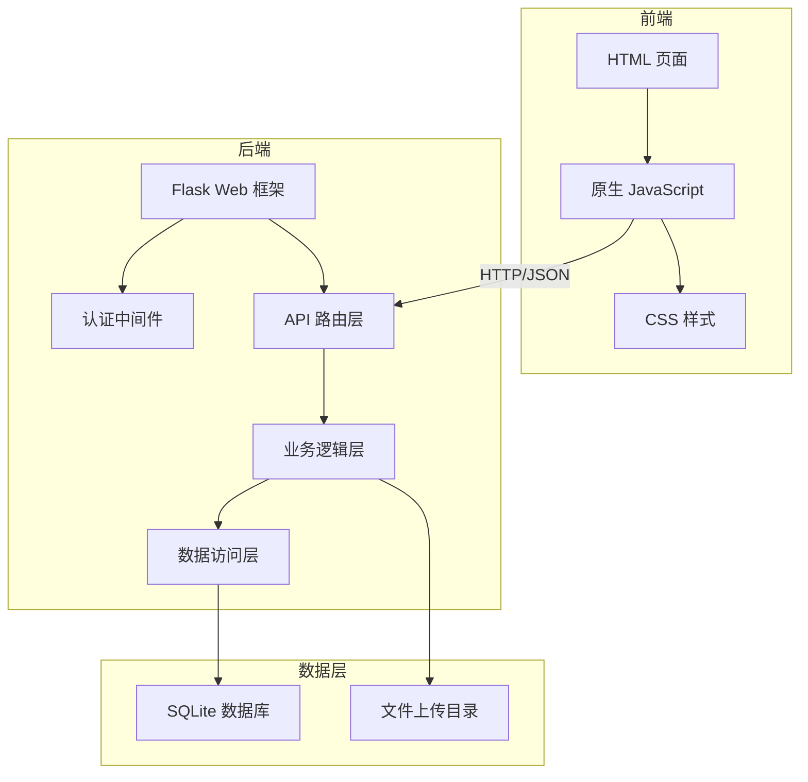
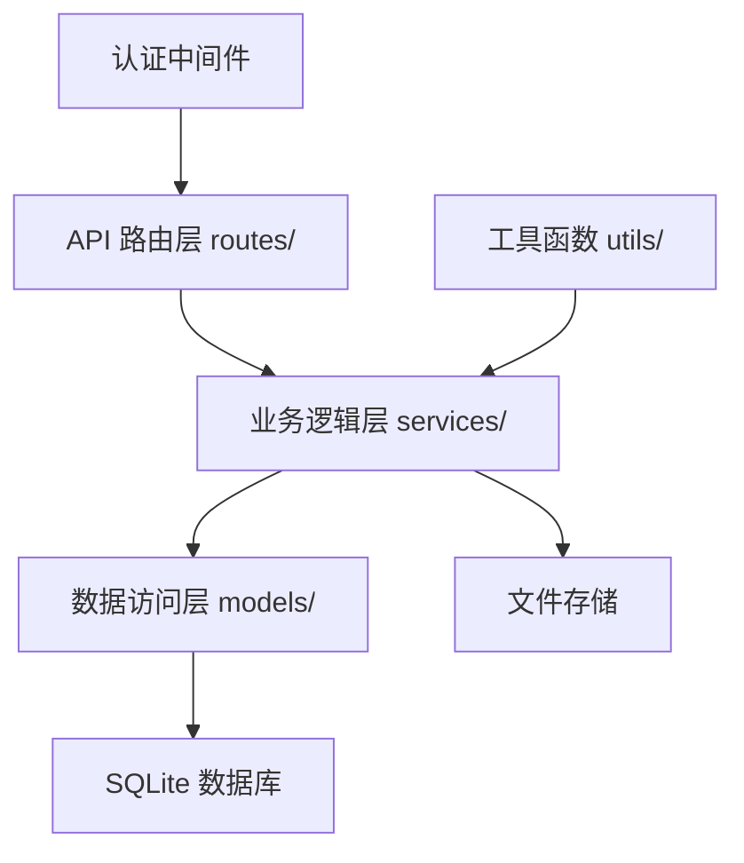
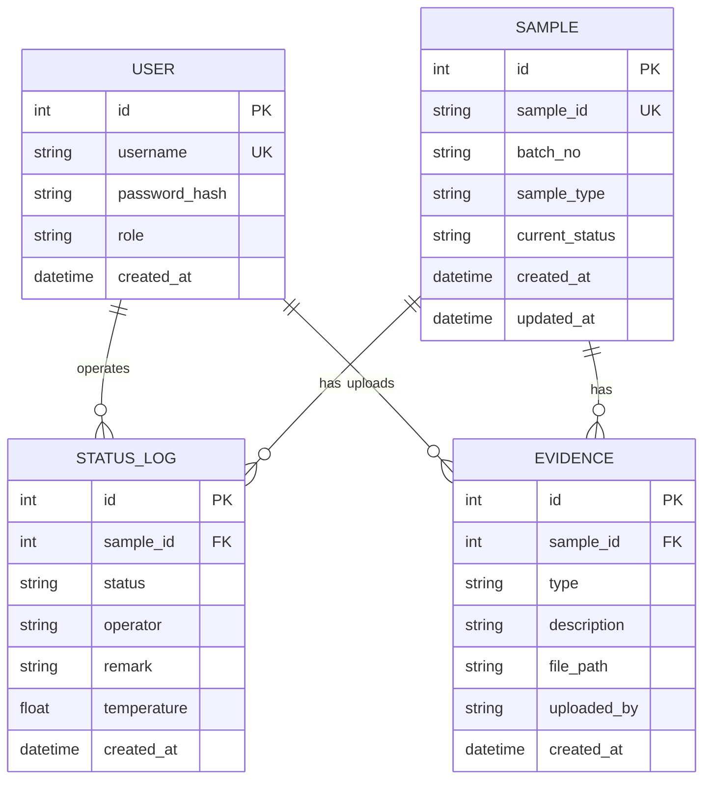

## 1. 架构设计



## 2. 技术选型说明

- **前端**：原生 HTML + CSS + JavaScript（无需构建工具，轻量易部署）
- **后端**：Python 3 + Flask 3.x（轻量 Web 框架，适合本地部署）
- **数据库**：SQLite（单文件数据库，零配置，持久化存储）
- **认证**：Flask-Login + Session 会话管理
- **文件存储**：本地文件系统（证据照片存储）

## 3. 页面路由

| 路由 | 页面/接口 | 说明 |
|------|-----------|------|
| `/` | 首页（重定向到列表） | 未登录跳转到登录页 |
| `/login` | 登录页 | 用户登录界面 |
| `/samples` | 样本列表页 | 样本台账总览 |
| `/samples/<id>` | 样本详情页 | 单样本详情与操作 |
| `/api/auth/login` | POST 登录接口 | 用户名密码认证 |
| `/api/auth/logout` | POST 登出接口 | 清除会话 |
| `/api/samples` | GET 样本列表 | 分页/筛选查询 |
| `/api/samples/<id>` | GET 样本详情 | 含状态时间线、证据 |
| `/api/samples/import` | POST 批次导入 | CSV/JSON 批量导入 |
| `/api/samples/<id>/status` | POST 状态变更 | 入库/打包/交接/到达 |
| `/api/samples/<id>/exception` | POST 录入异常 | 超温/破损 + 证据 |
| `/api/samples/<id>/review` | POST 复核关闭 | 仅管理员可用 |
| `/api/export/handover` | GET 导出交接单 | CSV 格式导出 |
| `/api/evidence/upload` | POST 证据上传 | 照片文件上传 |

## 4. API 数据结构

### 4.1 样本对象 (Sample)

```typescript
interface Sample {
  id: number;
  sample_id: string;          // 样本唯一编号
  batch_no: string;           // 批次号
  sample_type: string;        // 样本类型
  current_status: string;     // 当前状态
  created_at: string;         // 创建时间
  updated_at: string;         // 更新时间
}
```

### 4.2 状态记录 (StatusLog)

```typescript
interface StatusLog {
  id: number;
  sample_id: number;
  status: string;             // 状态枚举值
  operator: string;           // 操作人
  remark: string;             // 备注
  temperature: number | null; // 温度记录
  created_at: string;
}
```

### 4.3 证据记录 (Evidence)

```typescript
interface Evidence {
  id: number;
  sample_id: number;
  type: string;               // photo / text / temperature
  description: string;        // 文字描述
  file_path: string | null;   // 文件路径
  uploaded_by: string;
  created_at: string;
}
```

### 4.4 状态枚举

```
PENDING        = "待入库"
WAREHOUSED     = "已入库"
PACKED         = "已打包"
HANDED_OVER    = "已交接"
ARRIVED        = "已到达"
FROZEN         = "异常冻结"
REVIEW_CLOSED  = "已复核关闭"
```

## 5. 后端分层架构



## 6. 数据模型

### 6.1 ER 图



### 6.2 DDL 语句

```sql
-- 用户表
CREATE TABLE users (
    id INTEGER PRIMARY KEY AUTOINCREMENT,
    username VARCHAR(50) UNIQUE NOT NULL,
    password_hash VARCHAR(255) NOT NULL,
    role VARCHAR(20) NOT NULL DEFAULT 'operator',
    created_at DATETIME DEFAULT CURRENT_TIMESTAMP
);

-- 样本表
CREATE TABLE samples (
    id INTEGER PRIMARY KEY AUTOINCREMENT,
    sample_id VARCHAR(100) UNIQUE NOT NULL,
    batch_no VARCHAR(100) NOT NULL,
    sample_type VARCHAR(100),
    current_status VARCHAR(50) NOT NULL DEFAULT 'PENDING',
    created_at DATETIME DEFAULT CURRENT_TIMESTAMP,
    updated_at DATETIME DEFAULT CURRENT_TIMESTAMP
);

-- 状态流转记录表
CREATE TABLE status_logs (
    id INTEGER PRIMARY KEY AUTOINCREMENT,
    sample_id INTEGER NOT NULL,
    status VARCHAR(50) NOT NULL,
    operator VARCHAR(50) NOT NULL,
    remark TEXT,
    temperature REAL,
    created_at DATETIME DEFAULT CURRENT_TIMESTAMP,
    FOREIGN KEY (sample_id) REFERENCES samples(id)
);

-- 证据表
CREATE TABLE evidences (
    id INTEGER PRIMARY KEY AUTOINCREMENT,
    sample_id INTEGER NOT NULL,
    type VARCHAR(20) NOT NULL,
    description TEXT,
    file_path VARCHAR(500),
    uploaded_by VARCHAR(50) NOT NULL,
    created_at DATETIME DEFAULT CURRENT_TIMESTAMP,
    FOREIGN KEY (sample_id) REFERENCES samples(id)
);

-- 索引
CREATE INDEX idx_samples_batch ON samples(batch_no);
CREATE INDEX idx_samples_status ON samples(current_status);
CREATE INDEX idx_status_logs_sample ON status_logs(sample_id);
CREATE INDEX idx_evidences_sample ON evidences(sample_id);
```

### 6.3 初始数据

```sql
-- 默认管理员账号 (admin/admin123)
-- 默认操作员账号 (operator/op123456)
INSERT INTO users (username, password_hash, role) VALUES
('admin', 'pbkdf2:sha256:...', 'admin'),
('operator', 'pbkdf2:sha256:...', 'operator');
```
